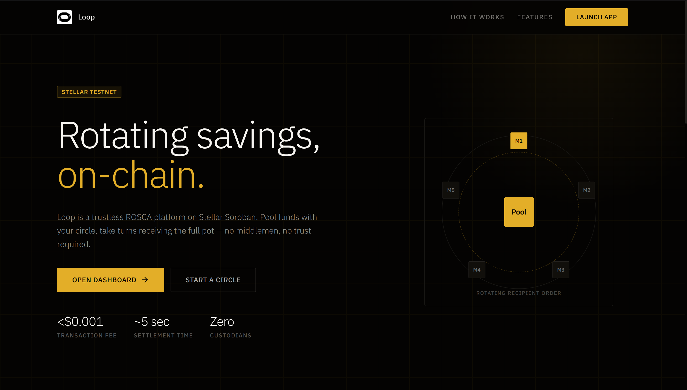
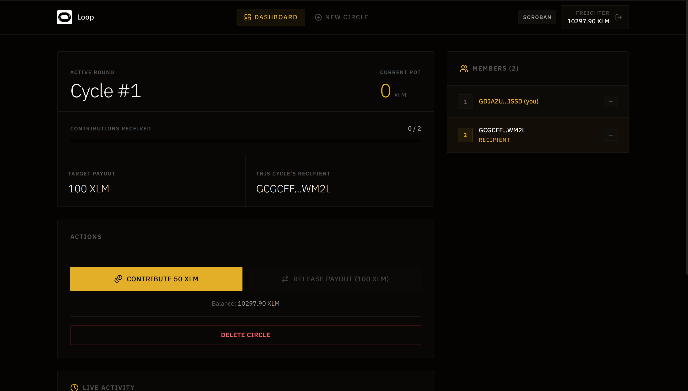
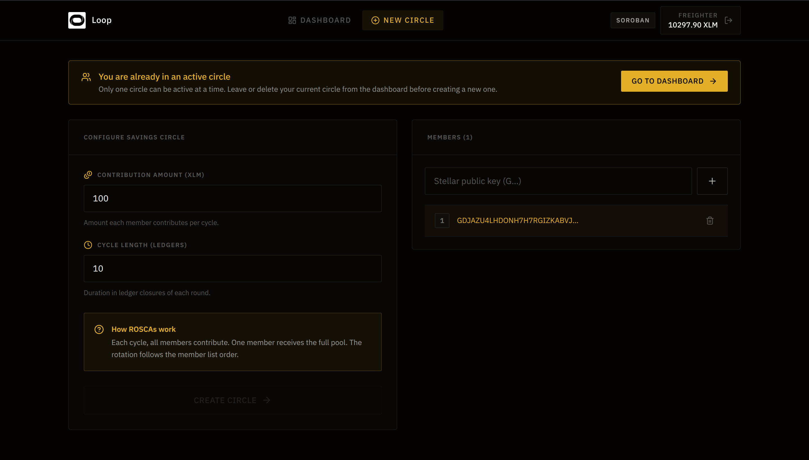
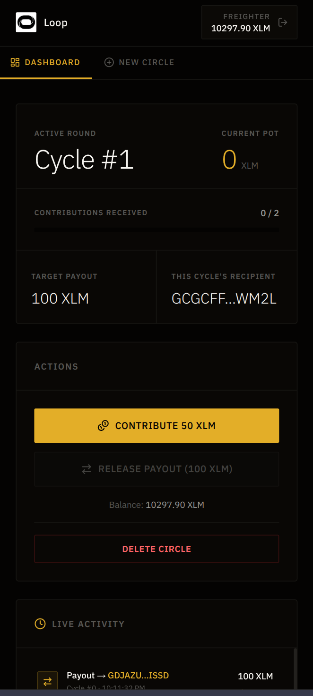
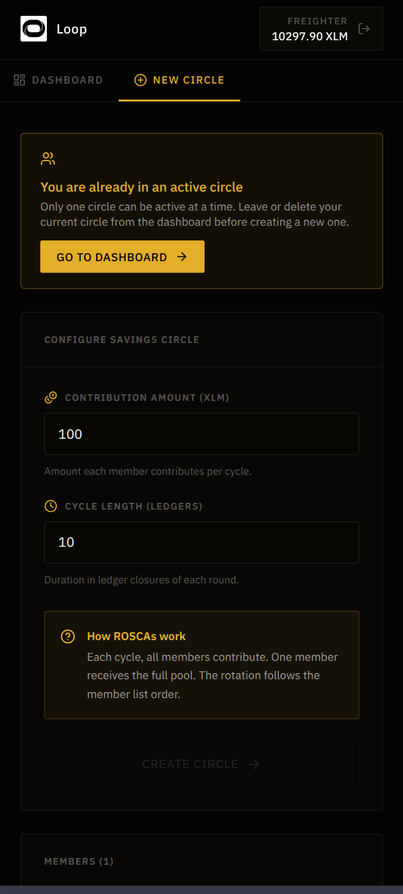
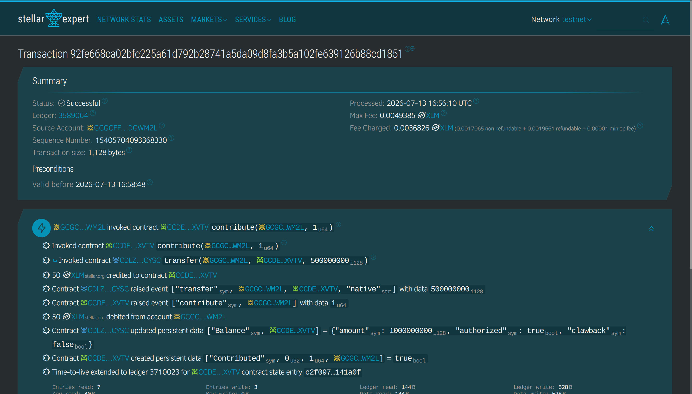
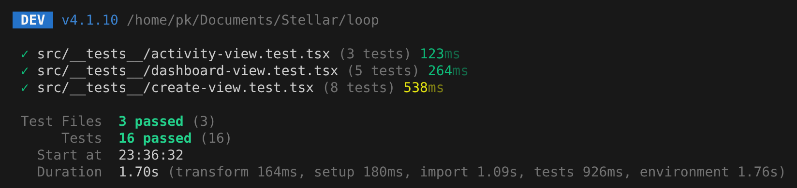
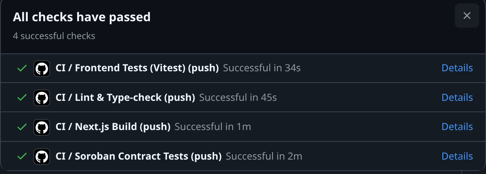

# Loop — Rotating Savings on Stellar

Loop is a trustless ROSCA (Rotating Savings and Credit Association) platform built on Stellar Soroban. Members pool XLM each cycle; the full pot rotates to one recipient per cycle until everyone has received. No middlemen, no custodians — all escrow logic lives on-chain.


## Quick Nav

- [Important Links & Deployed Contracts](#important-links--deployed-contracts)
- [Screenshots](#screenshots)
- [Features](#features)
- [Future Roadmap](#future-roadmap)
- [Architecture](#architecture)
- [Installation & Local Setup](#installation--local-setup)
- [Smart Contract Development](#smart-contract-development)
- [CI/CD](#cicd)
- [Contributing](#contributing)

---

## Important Links & Deployed Contracts

| Resource | Link |
|---|---|
| Live dApp | [loop-stellar.vercel.app](https://loop-stellar.vercel.app) |
| Demo Video | [Watch on youtube](https://youtu.be/P-EAgVsGwMY) |
| Pool Contract | [`CCDEDVFTT6C6YEJC472HVJJLP3U25CX5GJCL7VTDOV753IMUJ5EKXVTV`](https://stellar.expert/explorer/testnet/contract/CCDEDVFTT6C6YEJC472HVJJLP3U25CX5GJCL7VTDOV753IMUJ5EKXVTV) |
| Member Registry | [`CA4VMD62IU7ZP4C537HY7MKURC7TAFCT3QBXENGZGVB5WQZMQU7EUO26`](https://stellar.expert/explorer/testnet/contract/CA4VMD62IU7ZP4C537HY7MKURC7TAFCT3QBXENGZGVB5WQZMQU7EUO26) |
| SAC Token | [`CDLZFC3SYJYDZT7K67VZ75HPJVIEUVNIXF47ZG2FB2RMQQVU2HHGCYSC`](https://stellar.expert/explorer/testnet/contract/CDLZFC3SYJYDZT7K67VZ75HPJVIEUVNIXF47ZG2FB2RMQQVU2HHGCYSC) |
| Verifiable Transaction | [`92fe668c…cd1851`](https://stellar.expert/explorer/testnet/tx/92fe668ca02bfc225a61d792b28741a5da09d8fa3b5a102fe639126b88cd1851) |

---

## Screenshots

### Home



### Dashboard



### Create Circle



### Mobile

<table>
  <tr>
    <td></td>
    <td></td>
  </tr>
</table>

### Testnet Transaction



### Vitest



### CI/CD



---

## Features

- **Soroban smart contracts** — all fund escrow, contribution tracking, and payout logic runs on-chain. No admin keys, no multisig.
- **Deterministic payout order** — recipient sequence is locked at circle creation. No randomness, no disputes.
- **Creator-defined membership** — the circle creator sets the member list and contribution amount before any funds move.
- **Multi-wallet support** — connect with Freighter, Lobstr, xBull, or any wallet supported by Stellar Wallets Kit.
- **Live activity log** — contributions and payouts surface in real-time on the dashboard, each linked to its on-chain transaction hash.
- **Leave / delete circle** — non-creator members can leave and receive a refund of their current-cycle contribution. The creator can dissolve the circle entirely and refund all contributors.
- **Dual contract architecture** — a `pool-contract` handles fund flows; a `member-registry` contract independently tracks membership and validates payout recipients, preventing recipient mismatch attacks.
- **Wallet-gated dashboard** — the dashboard requires a connected wallet before fetching any on-chain state.

---

## Future Roadmap

- **Scheduled automatic payouts** — trigger payout via a Stellar ledger time condition instead of requiring manual invocation.
- **Multi-circle support** — allow a single wallet to participate in multiple independent circles simultaneously.
- **Circle invitations** — off-chain invite links that add a member's key to a pending circle before deployment.
- **Push notifications** — webhook-driven alerts (contribution received, payout triggered, new cycle started) via the existing API layer.
- **Mobile-first PWA** — installable progressive web app with deep-link support for wallet signing flows.
- **Contribution history export** — downloadable CSV of all cycle activity for a given circle.
- **Mainnet support** — configuration toggle to switch from Testnet to Mainnet with appropriate safety warnings.

---

## Architecture

Loop is split into two layers: a Next.js frontend and two Soroban smart contracts. They interact exclusively through signed Stellar transactions — no backend, no database.

### Frontend

The app shell (`layout.tsx`) handles wallet connection via Stellar Wallets Kit and exposes a React context (`circle-context.tsx`) that holds all runtime state — connected wallet, circle membership, contribution status, and transaction history. Every component reads from and writes to this context. On-chain reads use `simulateTransaction` (no fees, no signing); writes go through the full sign → submit → poll confirmation flow.

### Smart contracts

Two contracts work in tandem:

**Pool Contract** is the escrow engine. It holds contributed XLM, tracks which members have paid in each cycle, and releases the full pot to the recipient when all contributions are present. It never decides the recipient on its own.

**Member Registry** is the source of truth for membership order. When a payout is triggered, the pool contract calls `get_next_recipient` on the registry and compares the result against its own calculated index. If they disagree, the payout panics. This dual-check prevents recipient manipulation if the on-chain member list were somehow modified.

```
Browser
  └── Stellar Wallets Kit ──► sign transaction
        │
        ▼
  Soroban RPC (simulateTransaction / sendTransaction)
        │
        ├── Pool Contract
        │     ├── create_circle
        │     ├── contribute      ──► holds XLM in escrow
        │     └── payout          ──► cross-checks with Registry
        │                                    │
        └── Member Registry  ◄───────────────┘
              ├── get_next_recipient
              └── mark_paid
```

### State lifecycle

1. **Connect** — Wallets Kit opens the auth modal; Horizon returns the current XLM balance.
2. **Create circle** — frontend calls `reset_registry` → `register_members` on the registry, then `create_circle` on the pool.
3. **Contribute** — each member signs `contribute(member, cycle_id)`; XLM moves from the member's account to the pool contract address.
4. **Payout** — any member calls `payout(cycle_id)`; pool verifies all contributions, cross-checks the registry, transfers the full pot.
5. **Next cycle** — dashboard re-fetches state via read-only simulate calls; cycle counter increments automatically.

---

## Installation & Local Setup

### Prerequisites

- Node.js 20+
- pnpm 10+
- A Stellar testnet wallet (Freighter recommended)
- Testnet XLM from [friendbot](https://friendbot.stellar.org)

### Steps

```bash
# 1. Clone
git clone https://github.com/your-org/loop.git
cd loop

# 2. Install dependencies
pnpm install

# 3. Configure environment
cp .env.example .env
```

Edit `.env` and fill in your deployed contract IDs:

```env
NEXT_PUBLIC_STELLAR_HORIZON_URL=https://horizon-testnet.stellar.org
NEXT_PUBLIC_STELLAR_NETWORK_PASSPHRASE=Test SDF Network ; September 2015
NEXT_PUBLIC_STELLAR_RPC_URL=https://soroban-testnet.stellar.org/

NEXT_PUBLIC_SOROBAN_POOL_CONTRACT_ID=<your pool contract ID>
NEXT_PUBLIC_SOROBAN_REGISTRY_CONTRACT_ID=<your registry contract ID>
NEXT_PUBLIC_SOROBAN_TOKEN_CONTRACT_ID=<your SAC token contract ID>
```

```bash
# 4. Start dev server
pnpm dev
```

Open [http://localhost:3000](http://localhost:3000).

### Available scripts

| Script | Description |
|---|---|
| `pnpm dev` | Start Next.js dev server |
| `pnpm build` | Production build |
| `pnpm start` | Start production server |
| `pnpm test` | Run Vitest in watch mode |
| `pnpm test:ci` | Run Vitest once (CI mode) |
| `pnpm lint` | ESLint |
| `pnpm typecheck` | TypeScript type-check |

---

## Smart Contract Development

### Stack

- Rust (edition 2024)
- `soroban-sdk` v27.0.0
- Target: `wasm32v1-none`

### Contracts

**`pool-contract`** — core ROSCA logic.

| Function | Description |
|---|---|
| `initialize(token, registry)` | One-time setup, links token and registry contracts |
| `create_circle(members, amount, length)` | Deploy a new circle with member list and contribution amount |
| `contribute(member, cycle_id)` | Transfer `amount` XLM from member to contract escrow |
| `payout(cycle_id)` | Release full pot to the cycle's recipient once all members have contributed |
| `leave_circle(caller)` | Member exits; current-cycle contribution refunded if already paid |
| `delete_circle(caller)` | Creator dissolves circle; all current-cycle contributions refunded |
| `get_members / get_contribution_amount / get_cycle_length` | Read-only getters |
| `is_contributed(cycle_id, member)` | Check if a member has contributed in a given cycle |
| `is_cycle_paid(cycle_id)` | Check if a cycle has already been paid out |

**`member-registry`** — independent membership and recipient validation.

| Function | Description |
|---|---|
| `register_members(members)` | Store the ordered member list |
| `get_next_recipient(cycle_id)` | Return `members[cycle_id % len]` |
| `mark_paid(cycle_id, member)` | Record a completed payout |
| `remove_member(caller)` | Remove a member from the registry |
| `reset_registry(caller)` | Clear the member list (used before creating a new circle) |

### Running contract tests

```bash
cd contracts
cargo test --workspace
```

9 test cases covering:

- Full happy-path cycle (all members contribute → payout → correct recipient)
- Correct payout amount calculation
- Payout recipient rotation across multiple cycles
- Rejection of payout when contributions are missing
- Rejection of recipient mismatch between pool and registry
- Double-contribution prevention
- Contribution to an already-closed cycle
- Empty member list rejection
- Single-member circle (contributes to itself)

### Building WASM

```bash
cd contracts
cargo build --target wasm32v1-none --release
```

---

## CI/CD

GitHub Actions runs four jobs on every push to `main` / `dev` and every PR targeting `main`:

| Job | What it does |
|---|---|
| **Soroban Contract Tests** | Installs Rust stable + `wasm32v1-none` target, runs `cargo test --workspace` with Cargo cache |
| **Frontend Tests (Vitest)** | Sets up Node 20 + pnpm 10, installs deps, runs `pnpm test:ci` |
| **Lint & Type-check** | Runs `pnpm lint` (ESLint) then `pnpm typecheck` (tsc --noEmit) |
| **Next.js Build** | Runs after frontend tests and lint pass; executes `pnpm build` and uploads the `.next/` artifact (7-day retention) |

The build job depends on both `frontend-tests` and `lint-typecheck` passing first, so a broken build never reaches production artifacts.

```
push / PR
    │
    ├── contract-tests   (Rust / Soroban)
    ├── frontend-tests   (Vitest)
    └── lint-typecheck   (ESLint + tsc)
                │
                └── build  (Next.js, only if both pass)
```

---

## Contributing

1. Fork the repo and create a branch from `dev`.
2. Make your changes. Run tests before opening a PR:
   ```bash
   pnpm test:ci          # frontend
   cd contracts && cargo test --workspace  # contracts
   pnpm typecheck        # types
   ```
3. Open a PR targeting `dev`. CI must be green before review.
4. Keep PRs focused — one concern per PR makes review faster.

For larger changes, open an issue first to discuss the approach.
